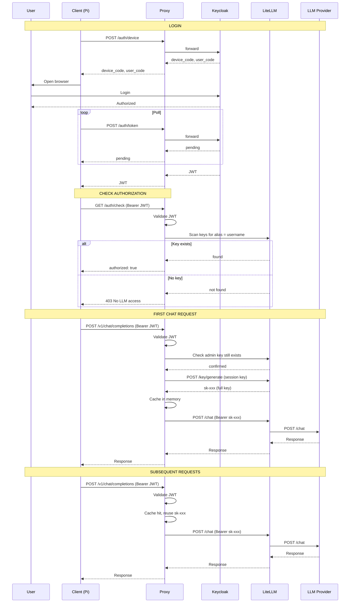

# Usage Flow

## Admin: provision a user

```bash
curl -X POST http://localhost:4001/key/generate \
  -H "Authorization: Bearer $MASTER_KEY" \
  -d '{
    "key_alias": "testuser",
    "max_budget": 50.0,
  }'
```

Key must have `key_alias` matching the Keycloak username (`preferred_username` claim).

---

## User: login and use LLM



---

## Token Lifecycle

| Token | Source | Expiry | Notes |
|-------|--------|--------|-------|
| Keycloak JWT | Device flow | 1 hour | Auto-refreshed by extension |
| Admin key (alias = username) | Admin `/key/generate` | Permanent | Authorization only, not used for requests |
| Session key (sk-xxx) | Proxy on first request | Session lifetime | Cached in proxy memory, full key for API calls |

## Permission checks

| Point | What happens | If denied |
|-------|-------------|-----------|
| `/auth/check` | Proxy scans LiteLLM for key with `key_alias = username` | `403 No LLM access. Contact admin.` |
| Chat request | Proxy verifies JWT signature locally (JWKS) | `403 Invalid token` |
| LiteLLM per request | LiteLLM checks budget and rate limits | `429 Budget exceeded` |
