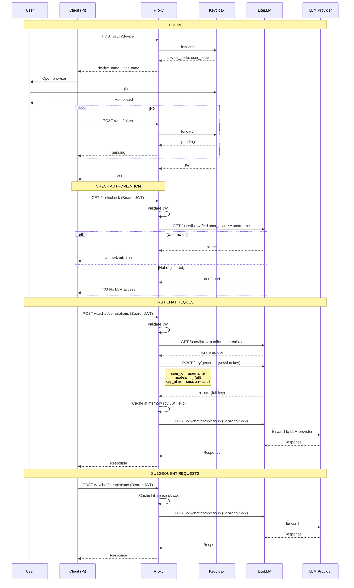

# Usage Flow

## Admin: Register a user in LiteLLM

Admin creates a user in LiteLLM admin UI (`http://localhost:4001`) or via API:

```bash
curl -X POST http://localhost:4001/user/new \
  -H "Authorization: Bearer $MASTER_KEY" \
  -H "Content-Type: application/json" \
  -d '{
    "user_alias": "jkyangc",
    "user_email": "user@example.com",
    "models": []
  }'
```

`user_alias` must match the Keycloak username (`preferred_username` claim).
`models: []` gives access to all models the proxy routes.

---

## User: login and use LLM



---

## Stale Key Recovery

If the session key is manually deleted from LiteLLM admin UI:

```
chat request → cache hit (stale key) → LiteLLM returns 401
    → proxy clears cache
    → re-validates user registration (user_alias check)
    → creates new session key
    → retries request → 200 OK
```

---

## Token Lifecycle

| Token | Source | Expiry | Notes |
|-------|--------|--------|-------|
| Keycloak JWT | Device flow | 1 hour | Auto-refreshed by extension |
| LiteLLM user (user_alias) | Admin `/user/new` | Permanent | Registration only, maps to Keycloak username |
| Session key (sk-xxx) | Proxy on first request | Until blocked | Cached in proxy memory, bound to `user_id = username` |

## Permission checks

| Point | What happens | If denied |
|-------|-------------|-----------|
| `/auth/check` | Proxy looks up user by `user_alias` in `/user/list` | `403 No LLM access. Contact admin to register your account.` |
| Chat request | Proxy verifies JWT signature locally (JWKS) | `403 Invalid token` |
| First chat / key create | Proxy re-checks user registration | `403 No LLM access` |
| Stale key recovery | Proxy re-checks user registration | `403 No LLM access` (user deleted from LiteLLM) |
| LiteLLM per request | LiteLLM checks budget and rate limits | `429 Budget exceeded` |

## API Endpoints

| Endpoint | Method | Auth | Description |
|----------|--------|------|-------------|
| `/auth/device` | POST | None | Keycloak device authorization |
| `/auth/token` | POST | None | Keycloak token polling |
| `/auth/check` | GET | Bearer JWT | Validate JWT + check user registration |
| `/v1/chat/completions` | POST | Bearer JWT | Chat via proxy → LiteLLM |
| `/chat/completions` | POST | Bearer JWT | Same as above (alternative path) |
| `/v1/models` | GET | Master key | List models from LiteLLM |
| `/logout` | POST | Bearer JWT | Block session key |
| `/health` | GET | None | Health check |
